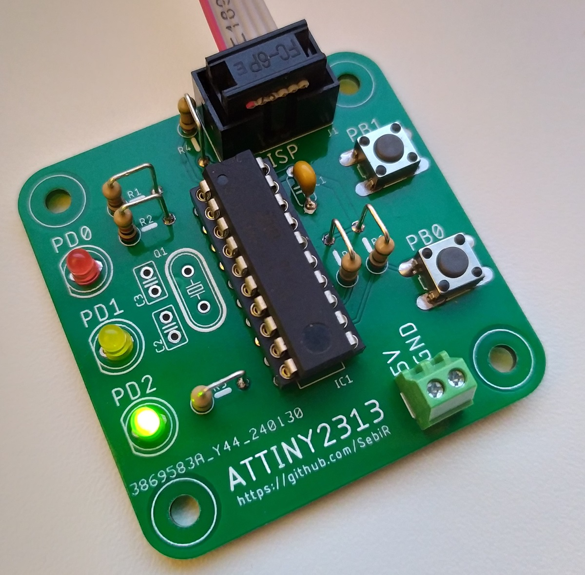

# Minimal Controller Boards

A collection of small microcontroller boards for different kinds of controllers with minimal external components, some LEDs and some switches

They have no real purpose. Maybe as an educational board to learn soldering and programming?

The ICSP/ISP/... connector is exposed, but you'll need the programmer accordingly.